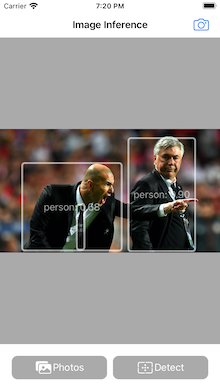
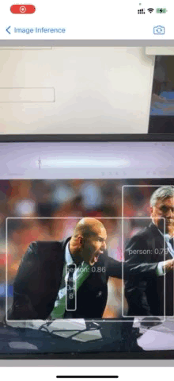

# YOLOv5-CoreML
YOLOv5 inference demo for CoreML in image or camera.

1. Convert [YOLOv5 to CoreML](https://rockyshikoku.medium.com/convert-yolov5-to-coreml-also-add-a-decode-layer-113408b7a848).
2. Inference with CoreML.

